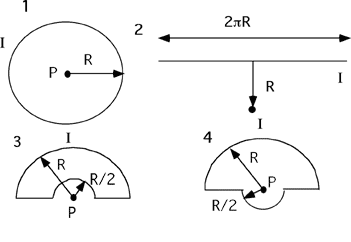

In all cases the wire shown carries a current I.  For which situation
is the magnitude of the magnetic field maximum at the point P?

### Answer

(4) #4 is larger than #3 because contributions from the two half circles
reinforce in #4 rather than oppose each other as in #3. #4 is larger
than #1 because #4 has a half loop at half the radius. Situation #2
having a finite length of wire is a distracter. The field in #2 is
smaller than #3 and would be even if the wire in #2 were infinite. An
interesting follow-up is to ask students to well order the cases
according to the strength of the field.
