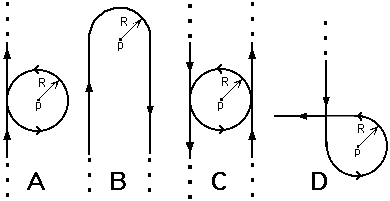

Order the following situations according to the magnitude of the
magnetic field at the point P.  Order from highest to lowest.

1. ABCD
2. ADBC
3. BDAC
4. CADB
5. DABC
6. None of the above

### Answer

(6) This question poses a good exercise for students. They can reason
comparatively without having specific expressions for the field
contributions from wires or loops. The order is CDBA. 
