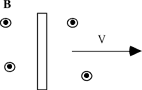

## The question for students:

A long conducting bar moves with a constant velocity in a uniform magnetic
field.  If the bar and the velocity of the bar are perpendicular to the
magnetic field as shown. Which of the following statements are true?

<blockquote> <ol type="A"> <li>At steady state there is an E field in
the bar</li> <li>At steady state there is a current in the bar</li>
<li>At steady state there is a mag. force on bar</li> </ol>
</blockquote>

1. A only
2. B only
3. C only
4. A and B only
5. A and C only
6. B and C only
7. A, B, and C

## Commentary for teachers:

### Answer

(1) This question is often given as an example of Faraday's law.
Relating Emf to flux change is difficult for some students to perceive
when there is no circuit. Creating an imaginary circuit helps, but many
students continue to get the direction of the field incorrect even
though the magnitude of the potential difference is now understood. It
is useful to view the process using the Lorentz force. This helps
students understand which charges migrate to which end and, therefore,
what the direction of the electric field in the bar is. 
