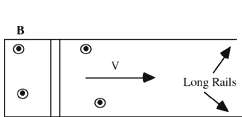

{: .image-right } A
conducting bar is placed on a set of horizontal rails.  After a uniform
magnetic field is set up perpendicular to the rails, the bar is given a
push.  As the bar moves along the rails, which of the following
statements are true.

<blockquote> <ol type="A"> <li>There is an E field in the bar</li>
<li>There is a current in the bar</li> <li>The bar moves with a constant
speed </li> </ol> </blockquote>

1. A only
2. B only
3. C only
4. A and B
5. A and C
6. B and C
7. A, B, and C
8. None are true

### Answer

(4) In the absence of a force sustaining the motion, the bar slows down.
It is interesting to discuss what happens to the kinetic energy as the
bar slows down. Advanced students can work out that the energy is
dissipated in the resistance of the bar.
