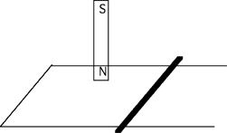

{: .image-right } A
conducting bar is placed on a set of horizontal rails.  A bar magnet is
positioned above the rails with its north pole facing the rails, and is
then released.  While the magnet falls toward the rails, which of the
following statements are true.

<blockquote> <ol type="A"> <li>There is an electric field in the
bar</li> <li>There is a current in the bar</li> <li>The bar remains
stationary</li> </ol> </blockquote>

1. A only
2. B only
3. C only
4. A and B
5. A and C
6. B and C
7. A, B, and C

### Answer

(4) As the bar magnet falls, the magnetic flux through the circuit will
change. This will cause an E field and current in the conducting bar.
The conducting bar will also experience a magnetic force due to the
current flowing in the bar.
