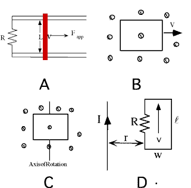

For which of the following is there an induced emf?

<blockquote> <ol type="A"> <li>A conducting rod is pulled on conducting
rails that are placed in a uniform magnetic field directed into the
page.</li> <li>A conducting loop moves through a uniform magnetic field
directed into the page.</li> <li>A conducting loop rotates in a uniform
magnetic field directed into the page.</li> <li>A conducting loop moves
in a magnetic field produced by an infinite current-carrying wire.</li>
</ol> </blockquote>

1. A only
2. A and B only
3. A and C only
4. A and D only
5. B and C only
6. A, B, and C 
7. A, C, and D
8. All of them
9. None of the above

###Answer

(3) Viewing the various cases using the Lorentz force law helps students
understand why current flows in those loops experiencing a change of
magnetic flux. 
...
