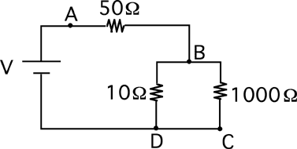

Consider the circuit below.  Which resistor has the greatest power
consumption?

1. The 50Ω resistor
2. The 10Ω resistor
3. The 1000Ω resistor
4. The 50Ω and 10Ω resistors
5. The 50Ω and 1000Ω resistors
6. The 10Ω and 1000Ω resistors
7. All have the same power.

### Answer

(1) The potential drop over the 10Ω and 1000Ω resistors is the same.
Since power goes as V^2^/R, more power is consumed in the 10Ω resistor
than the 1000Ω resistor. Further, since power also goes as I^2^R and only
a fraction of the current through the 50Ω resistor flows through the 10Ω
resistor, the 50Ω resistor must dissipate the most energy.
