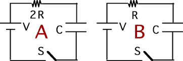

Consider the following circuits.  Two identical batteries are connected
to two identical capacitors in series with different resistors.  The
capacitors are initially uncharged. Which statement is true regarding
the energy supplied by the batteries to charge the capacitor?

1. The battery in A does more work.
2. The battery in B does more work.
3. Both batteries do the same work.
4. Cannot be determined

###Answer

(3) The energy dissipated in the resistor is independent of the
resistance. Consider a time when the capacitor contains some charge Q.
If an additional charge dq is added, the battery does work dqV and the
increment of stored energy in the capacitor is (Q/C)dq. By conservation
of energy, the difference must have been dissipated in the resistor. The
difference, [V-(Q/C)]dq is independent of resistance. 
...
