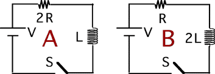

Consider the following circuits.  Two identical batteries are
connected to two identical inductors in series with different resistors.
 The switch is closed at t=0. Which is true regarding the energy
supplied by the battery to establish current I?

1. The battery in A does more work.
2. The battery in B does more work.
3. Both batteries do the same work.
4. Cannot be determined

###Answer

(4) It is not determined that either circuit can achieve the current I.
If I is to be interpreted as the 'final' current, then the answer is #2.
The lower the resistance the higher the final current. There is more
energy stored in the inductor if the final current is higher. In
addition, the energy dissipated in the resistor goes as i2R which is
larger for circuit B for every current larger than V/(2R).
