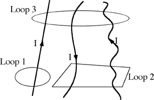

Three wires, each carrying the same current, I, are in a region of
space, as shown below.  What could be the result of computing the left
hand side of Ampere's law, , for the
three Amperian Loops shown?

1. Loop 1: μ0I, Loop 2: 2μ0I, Loop 3: 3μ0I
2. Loop 1: -μ0I, Loop 2: 0, Loop 3: μ0I
3. Loop 1: μ0I, Loop 2: 2μ0I, Loop 3: μ0I
4. Cannot be determined

###Answer

(4) The direction to integrate around the loop is not specified. The
only choice of responses that is possibly true is #2 and this would
require a clockwise integral around loop 1. 
