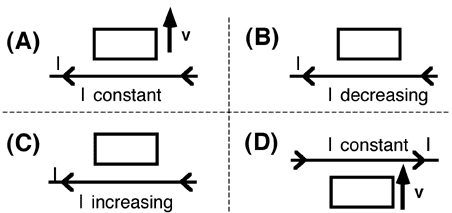

## The question for students:

Consider the four situations below in which a wire loop lies in the
plane of a long wire. In which case(s) is the induced current in the
loop in the counterclockwise direction? [Note: if no velocity is
indicated, the loop is stationary.]

1. A only
2. B only
3. C only
4. D only
5. A and B
6. C and D
7. All cases.
8. None of the above.

## Commentary for teachers:

### Answer

6. Discussing each of the cases is valuable. Students have difficulty
recognizing that the induced current is in a direction that causes the
field of the induced current to compensate for the change in flux. Even
when they nominally understand that, they have trouble reliably applying
the right hand rule.
