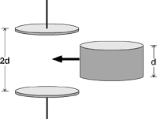

{: .image-right } 

Two parallel conducting plates form a capacitor.  It is isolated and a
charge Q is placed on it.  A metal cylinder of length half the plate
separation is then inserted between the plates. Which of the quantities
C, ΔV, Q, E, and U change?

1. C, E, and U only
2. ΔV and U only
3. C and U only
4. E and U only
5. C, ΔV, and U only
6. ΔV and E only
7. C and ΔV only
8. None of the above

###Answer

(8) Students who are formula bound find this a difficult question.
Obviously Q does not change. Depending on how students interpret the
question, they may conclude that E does or does not change. The value of
E in regions outside the cylinder does not change [Students taking this
interpretation may respond #5.], but inside the cylinder it is now zero.
Since E is now zero for half of the distance between the original
plates, both ΔV and U must change. That C also changes can be
appreciated in many different ways.

There are many good follow up questions, such as: Does it make a
difference where the cylinder is placed? How would the quantities change
if the cylinder was made of a dielectric material? Suppose a half
cylinder of length 2d were placed between the plates. How would
quantities change? 
