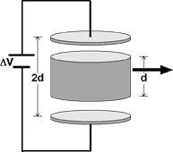

## The question for students:

{: .image-right }  Two
parallel conducting plates form a capacitor.  With a metal cylinder of
length half the plate separation inserted between the plates, it is
connected to a battery with potential ΔV.  The cylinder is now removed. 
Which of the quantities C, ΔV, Q, E, and U change?

1. C, E, and U only
2. Q and U only
3. C and U only
4. E and U only
5. Q, ΔV, and U only
6. ΔV and E only
7. C and Q only
8. None of the above

## Commentary for teachers:

### Answer 

(8) Since ΔV does not change, E must because the distance between
plates doubles. If E changes, so must Q. If Q changes, so must C.
Finally, that U chages can be seen in a variety of ways.

There are many good follow up questions, such as: How would the
quantities change if the cylinder was made of a dielectric material? 
