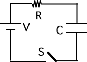

## The question for students:

{: .image-right } 
Consider the following circuit. The capacitor is uncharged when switch S
is closed at t = 0. After current stops flowing and the capacitor is
fully charged the energy stored in the capacitor is:

1. V^2^/R
2. CE^2^/2
3. QV/2
4. V/RC
5. none of the above

## Commentary for teachers:

### Answer

(3) The intent of this question is to provide students the opportunity
to distinguish a correct but uncommon form for the stored energy from a
number of other familiar forms.
