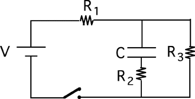

Consider the following circuit.

The capacitor is uncharged when the switch is closed at t=0. Which
circuit is equivalent to this circuit as t approaches infinity?

### Answer

(2) Students often misunderstand the statement that capacitors behave
like an open circuit after a long time.

This item is best used in conjunction with the previous one. Both should
be asked before discussion of either to reveal whether students just
have the behaviors reversed or evidence a more serious problem. 
