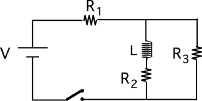

Consider the following circuit.

The switch is closed at t=0. Which circuit is equivalent to this circuit
for the instant immediately after the switch is closed?

###Answer

(2) Some students misunderstand the statement that inductors behave
initially as an open circuit and select #1 or #3.

This item is best used in conjunction with the next one. Both should be
asked before discussion of either to reveal whether students just have
the behaviors reversed or evidence a more serious problem. 
