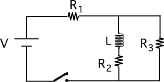

Consider the following circuit.

The switch is closed at t=0. Which circuit is equivalent to this circuit
as t approaches infinity?

### Answer

(3) Some students misunderstand the statement that inductors behave as a
short circuit after a long time and select #1 or #2.

This item is best used in conjunction with the previous one. Both should
be asked before discussion of either to reveal whether students just
have the behaviors reversed or evidence a more serious problem. 
