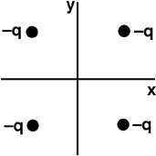

{: .image-right } Four
charges are positioned as shown.  What is the direction of the
electrical field at the origin?

1. Along i or in the +x direction
2. Along j or in the +y direction
3. Along -i or in the -x direction
4. Along -j or in the -y direction
5. Along some other direction
6. E=0 at the origin

### Answer

(6) Difficulty with this question usually indicates that students are
not familiar with vectors. Good follow up questions are to change the
sign of one or more charges. 
