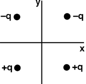

{: .image-right } Four
charges are positioned as shown.  What is the direction of the
electrical field at the origin?

1. Along i or in the +x direction
2. Along -j or in the -y direction
3. Along j or in the +y direction
4. Along -i or in the -x direction
5. Along some other direction
6. E=0 at the origin

### Answer

(3) Difficulty with this question indicates that students do not know
how the direction of the electric field relates to the sign of the
charge.
