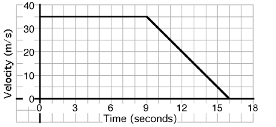

## The question for students:

{: .image-right } 

An object's motion is described by the graph above. The position of the
object at t = 9 seconds is most nearly...

1. 0 meters
2. 200 meters
3. 300 meters
4. 400 meters
5. 500 meters
6. Cannot be determined

## Commentary for teachers:

### Answer

(6) This problem is primarily to determine if students appreciate the
information available from a graph. Many students will determine the
displacement forgetting that the initial position is unknown.
