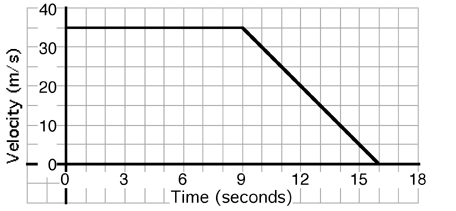

{: .image-right } 

An object's motion is described by the graph above. The displacement
of the object during the entire 16 seconds is most nearly...

1. 200 meters
2. 250 meters
3. 300 meters
4. 350 meters
5. 400 meters
6. 450 meters
7. Cannot be determined

### Answer

(7) Students have difficulty reading graphs and finding areas.

