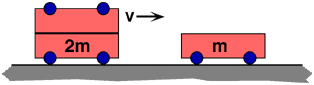

{: .image-right }  A
cart of mass 2m collides and sticks to a cart of mass m that is
initially at rest. Which cart exerts the larger force on the other?

1. m
2. 2m
3. Both exert the same force
4. Cannot be determined

###Answer

(3) Yet another instance of Newton's Third Law. Some students still
stumble because they the question considers the object exerting the
larger force as opposed to the one having the larger force applied to
it. 
...
