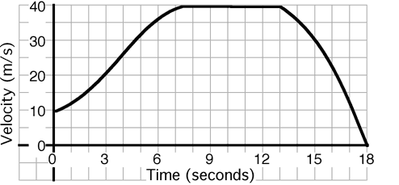

## The question for students:

An object's motion is described by the graph:

What is the instantaneous velocity at t = 3s?

1. 0 m/s
2. 2 m/s
3. 3 m/s
4. 4 m/s
5. 5 m/s
6. Other

## Commentary for teachers:

_No commentary available._
