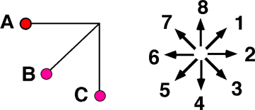

## The question for students:

A pendulum  is released from rest at position A and swings toward the
vertical under the influence of gravity as depicted below.

When at position B, which direction most nearly corresponds to the
direction of the acceleration?

Enter (9) if the direction cannot be determined.

## Commentary for teachers:

_No commentary available._
