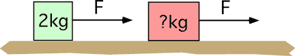

When a force F is applied to a mass of 2 kg, the mass accelerates with
6.3 m/s2.  When the same force is applied to an unknown mass
the acceleration is 9 m/s2. Assume no friction. The value of
the mass is

1. 0.3 kg
2. 0.7 kg
3. 1.2 kg
4. 4.5 kg
5. 14 kg
6. None of above.

...
