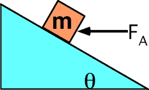

{: .image-right } 

An applied force FA pushes a block of mass m up a rough
incline having coefficient of kinetic friction &mu;k.  The
friction force on the block is

1. mgcos&theta;
2. mgsin&theta;
3. &mu;kmgsin&theta;
4. &mu;kmgcos&theta;
5. &mu;kmgtan&theta;
6. &mu;kmgsin&theta;cos&theta;
7. None of the above.
8. Can't be determined.

