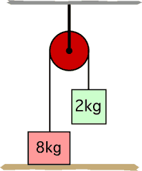

## The question for students:

{: .image-right } 

A string attached to an 8 kg mass is passed over a frictionless
pulley and attached to a 2 kg mass as shown. What is the tension in the
rope supporting the pulley? (Use g=10 N/kg)

1. 0 N
2. 20 N
3. 40 N
4. 60 N
5. 80 N
6. 100 N
7. None of above.
8. Can't be determined.

## Commentary for teachers:

_No commentary available._
