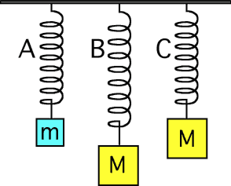

## The question for students:

{: .image-right } 

Consider the situations at right.

Let m < M. Which spring has the largest spring force?

1. A
2. B
3. C
4. A & B are equal.
5. A & C are equal.
6. B & C are equal.
7. All are the same.
8. Not enough information.

## Commentary for teachers:

_No commentary available._
