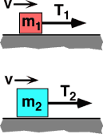

{: .image-right } 

Two blocks with mass m2>m1 sit on a horizontal
surface having friction. Both blocks are pulled with the same constant
speed, v, by a rope under tension. Which tension does the most work
moving the block a distance D along the surface?

1. T1 
2. T2 
3. Both do the same work. 
4. Cannot be determined.

