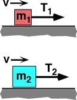

{: .image-right } 

Two blocks with mass m2 > m1 sit on a horizontal
surface having friction. Both blocks are pulled with a constant speed,
but v2 < v1, by a rope under tension.  Which
tension does the most work moving the block a distance D along the
surface?

1. T1
2. T2
3. Both do the same work.
4. Cannot be determined.

...
