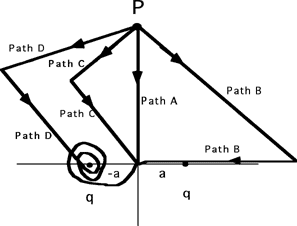

Consider moving a positive charge from point P to the origin along the
different paths shown in the diagram below.  For which path would you do
the most work?

{: .image-with-caption } 

1. Path A
2. Path B
3. Path C
4. Path D
5. Cannot determine
6. None of the above

...
