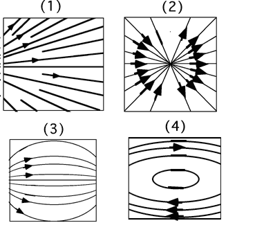

{: .image-right } 
Consider the four patterns for electric field lines.  Assuming there are
no charges within the regions shown, which represent(s) a possible
electric field?

1. 1 only 
2. 4 only 
3. 1 and 3 
4. 2 and 4 
5. 3 and 4 
6. None of the above

...
